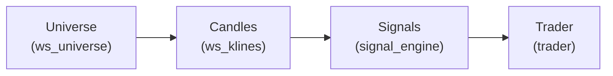

# Smart Scanner / Trading Bot

A modular crypto signal scanner and auto-trader for BloFin (paper/live). Scans markets for high-quality signals, supports external webhooks, and includes a real-time dashboard.

## Overview

- **Purpose**: Scans crypto markets for high-quality signals and can auto-trade them on BloFin (paper/live). Also accepts external signals via webhook.
- **Core Components**: WebSocket universe, candles/orderflow feeds, strategy engine, calibrator, regime detection, dedupe/cooldowns, AutoTrader with paper/live routing, JSONL metrics.

---

## Quickstart

### Requirements
- Python 3.10+

### Installation
```bash
# Install the package (from the smart_scanner folder)
pip install -e smart_scanner

# Optional: for .env loading
pip install python-dotenv
```

### Running the Scanner
```bash
# One-off scan
python -m smart_scanner.scanner_runner

# Polling loop (REST/WS mix)
python -m smart_scanner.scanner_runner --loop

# Event-driven loop (signals on WS bar close)
python -m smart_scanner.scanner_runner --event
```

### Running the Dashboard
```bash
cd dashboard
pip install -r requirements.txt
$env:METRICS_PATH = "C:\path\to\scanner_metrics.jsonl"  # Windows
python app.py
# Open http://localhost:8081
```

### Other Entry Points
```bash
# External signal webhook
python -m smart_scanner.signal_gateway --host 0.0.0.0 --port 8080

# Simple EMA cross bot
python -m smart_scanner.simple_bot --loop
```

---

## Configuration

Environment file: `smart_scanner/.env` (or export vars). Auto-loaded if `python-dotenv` is installed.

### Key Toggles
| Variable | Description |
|----------|-------------|
| `ENABLE_AUTOTRADE` | Set `1` to route signals to the trader |
| `PAPER_TRADING` | Set `1` for testing, `0` for live |
| `TRADE_NOTIONAL_USD` | Position size in USD |
| `TRADE_MIN_SCORE` | Minimum signal score threshold |
| `TRADE_MIN_PROB` | Minimum probability threshold |
| `SCORE_MIN` | Minimum score for signal generation |
| `PROB_MIN` | Minimum probability for signal generation (0.0 = disabled) |

### Smart TP/SL (Position-Level)
| Variable | Description |
|----------|-------------|
| `ENABLE_TPSL` | Enable take-profit/stop-loss |
| `TPSL_MODE` | Mode: `atr`, `bps`, or `level_atr` |
| `ATR_SL_MULT` | Stop-loss ATR multiplier (default: 1.2) |
| `ATR_TP1_MULT` | First TP ATR multiplier (default: 1.6) |
| `ATR_TP2_MULT` | Second TP ATR multiplier (default: 3.0) |

### Smart Risk (Dynamic Leverage)
| Variable | Description |
|----------|-------------|
| `ENABLE_SMART_RISK` | Enable dynamic leverage/margin |
| `LEV_MIN` / `LEV_MAX` | Leverage bounds |
| `LEV_BASE` | Base leverage |

### API Keys (Live Trading Only)
```bash
BLOFIN_API_KEY=your_key
BLOFIN_API_SECRET=your_secret
BLOFIN_API_PASSPHRASE=your_passphrase
```
> ⚠️ Never commit real keys. Use `.env.local` (git-ignored).

---

## Learning & Calibration

### Train Probability Calibration
```bash
python -m smart_scanner.learn calibrate \
  --metrics scanner_metrics.jsonl \
  --out calibration.json \
  --horizon 900
```
The engine uses `calibration.json` automatically on startup.

### Tune Thresholds
```bash
python -m smart_scanner.learn tune \
  --metrics scanner_metrics.jsonl \
  --horizon 900 \
  --objective ev \
  --min-trades 50
```

### Generate Lift Report
```bash
python -m smart_scanner.learn report \
  --metrics scanner_metrics.jsonl \
  --horizon 900
```

### Backfill Labels
```bash
python -m smart_scanner.learn backfill \
  --metrics scanner_metrics.jsonl \
  --horizon 900 \
  --limit 1000
```

---

## How It Works



1. **Universe**: Streams tickers, ranks by 24h volume, applies liquidity gates
2. **Data**: Candles via WS or REST fallback; optional orderflow features
3. **Signals**: Strategy engine blends via bandit/regime/calibration
4. **Selection**: Best per timeframe → best per symbol → capped per loop
5. **Trading**: Evaluates gates, places paper fills or live orders with TP/SL

---

## External Signals (Webhook)

```bash
# Start webhook server
python -m smart_scanner.signal_gateway --host 0.0.0.0 --port 8080
```

### POST to `/signal` or `/webhook`
```json
{
  "symbol": "BINANCE:BTCUSDT",
  "side": "long",
  "timeframe": "15m",
  "price": 50000,
  "score": 5.1,
  "prob": 0.7,
  "components": ["tv"],
  "tags": ["ext"]
}
```

Secure with `WEBHOOK_SECRET` env var and `X-Webhook-Token` header.

---

## Emergency Controls

### Kill Switch
```bash
KILL_SWITCH=1  # or create .panic file
```

### Manual Emergency CLI
```bash
# Cancel + close all
python -m smart_scanner.emergency --all

# Cancel only
python -m smart_scanner.emergency --cancel

# Close only
python -m smart_scanner.emergency --close

# Limit to specific symbols
python -m smart_scanner.emergency --all --symbols BTC-USDT,SOL-USDT
```

---

## PnL Report

```bash
python -m smart_scanner.pnl_report \
  --metrics scanner_metrics.jsonl \
  --days 30 \
  --csv  # optional CSV output
```

---

## Troubleshooting

| Issue | Solution |
|-------|----------|
| No signals | Lower `SCORE_MIN` or set `PRINT_DIAGNOSTICS=1` |
| WS slow to populate | Increase `WS_UNIVERSE_READY_WAIT_SEC` |
| Trailing doesn't move | Check `ENABLE_TRAILING=1` and API keys |
| Rate limits | Adjust `BLOFIN_MIN_REQ_INTERVAL_MS` |
| .env not loading | Install `python-dotenv` |

---

## File Structure

### Root Files
| File | Description |
|------|-------------|
| `bandit_state.json` | Persisted EXP3 weights |
| `labels_state.json` | Labeler state |
| `scanner_metrics.jsonl` | Append-only metrics log |
| `calibration.json` | Trained probability calibration |

### Package: `smart_scanner/`
| Module | Description |
|--------|-------------|
| `scanner_runner.py` | Main entry point with `--loop` and `--event` modes |
| `signal_engine.py` | Converts candles to Signal objects |
| `strategies.py` | Trading strategies (breakout, EMA pullback, momentum, supertrend) |
| `trader.py` | AutoTrader and PaperBroker |
| `blofin_client.py` | Async REST client for BloFin |
| `ws_universe.py` | WebSocket universe builder |
| `ws_klines.py` | WebSocket candle store |
| `config.py` | Centralized configuration |

---

## Deployment

For 24/7 headless operation, see `deploy/README_DEPLOY.md` for Docker/Compose instructions.

---

## Development & CI

### Setup Dev Environment
```bash
# Install with dev dependencies
pip install -e "smart_scanner[dev]"
```

### Linting & Formatting
```bash
# Check for issues
ruff check .

# Auto-fix issues
ruff check --fix .

# Format code
ruff format .

# Type check
mypy .

# Spell check
codespell .
```

### Testing
```bash
pytest tests/ -v
```

### Pre-commit (Optional)
You can add a `.pre-commit-config.yaml` for automated checks:
```yaml
repos:
  - repo: https://github.com/astral-sh/ruff-pre-commit
    rev: v0.8.0
    hooks:
      - id: ruff
        args: [--fix]
      - id: ruff-format
```

---

## Security

- **Never commit real API keys** - use `.env.local` (git-ignored)
- Protect webhook with `WEBHOOK_SECRET` and network controls
